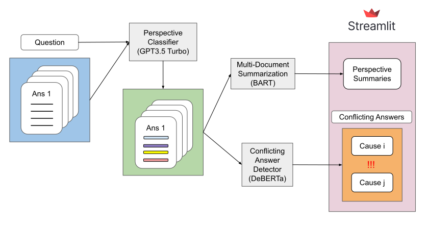

# Perspective-Informed Mult-Answer Summarization for Community Health Forums

Given the vastly accessible access to online communities, more and more people rely on online forums to answer their inquiries including medical questions. Numerous online community platforms, such as Reddit, Yahoo Answers, Quora, and AskMD, offer Community Health Forums (CHFs), forums specifically targeted to healthcare questions. However, answers on CHFs are frequently quite extensive and may be repetitive or conflicting. Our project aims to tackle this problem by condensing multiple responses into a single summary by taking into account their perspectives, enabling users to quickly access essential information. This approach seeks to offer a more thorough grasp of health-related matters. 

The methodology for our project involves several key steps. We will begin with zero-shot classification to label sentences in answers based on their perspectives, encompassing categories like "information", "cause", "treatment", "suggestion", "experience", and clarification. Following this, we implement multi-document summarization at the answer level, utilizing the assigned perspective labels to influence the summary generation process. We will also highlight relevant sentences from all answers using ranking algorithms like BM25. Furthermore, we will employ natural language inference (NLI) to detect conflicting pairs of statements among the answers, ensuring that users are informed about any contradictory information.

We will leverage existing research in zero-shot classification and multi-document summarization to inform our approach. Our primary dataset comprises the Yahoo! L6 corpus, which encompasses 4.5 million questions spanning various topics. Our focus will be on the "Health" category, which includes 21 sub-categories such as allergies, diabetes, and heart diseases.

Our evaluation will use quantitative measures like SUPERT for multi-document summarization, but will also blend qualitative metrics to evaluate the relevance of adding the perspective labels into the model.

This comprehensive approach aims to streamline information retrieval and provide users with concise, relevant, and coherent summaries in the context of healthcare discussions. Finally, while this project mainly targets CHFs, we believe the same techniques can be applied to forums exclusive to physicians in order for them to parse answers efficiently.

## For using our pipeline, please refer to the README.md in each folder.